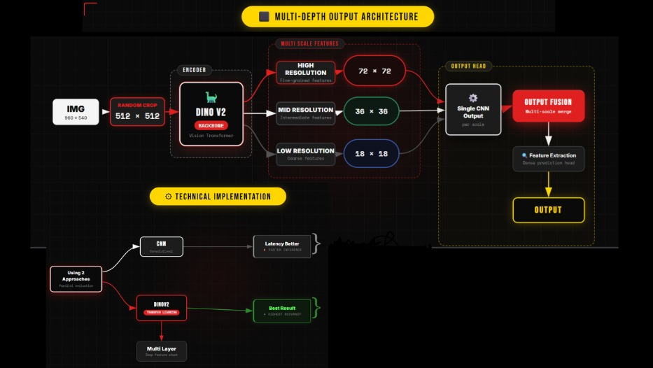

# AIʼs Offroad Semantic Scene Segmentation

## 🏆 Team Information

**Team Name:** ORCA
**Project:** Offroad Semantic Scene Segmentation

---

## [PERFORMANCE REPORT](PERFORMANCE_REPORT.docx) 

# 🌵 Project Overview

This project implements a **hybrid Transformer–CNN semantic segmentation architecture** tailored for off-road desert environments using synthetic data from Duality AI's Falcon platform.

Instead of a conventional U-Net, we design a **DINOv2-based transformer backbone fused with a convolutional feature pyramid neck**, enabling:

* Global semantic reasoning (Transformer attention)
* Local spatial refinement (CNN inductive bias)
* Multi-scale dense prediction
* Improved small-object sensitivity
* Real-time inference performance

---

# 🏗 Architecture Overview

## Hybrid Transformer–CNN Segmentation Model

<p align="center">
  
</p>

---

## 1️⃣ Backbone – DINOv2 (Vision Transformer)

* **Input:** 512×512 crop
* **Patch size:** 14
* **Token grid:** 36×36
* **Multi-depth feature extraction**
* **Global self-attention**

DINOv2 provides:

* Self-supervised large-scale pretraining
* Robust semantic embeddings
* Strong generalization across domains
* Dense patch-level feature representations

---

## 2️⃣ Multi-Depth Feature Extraction

Instead of using only the final transformer block, features are extracted from multiple depths:

* Early block → texture & edge features
* Middle block → object-level abstraction
* Final block → global semantic reasoning

All outputs are reshaped to spatial feature maps:

```
[B, C, 36, 36]
```

This enables semantic hierarchy without changing spatial resolution.

---

## 3️⃣ CNN Feature Pyramid Neck

Vision Transformers do not natively provide spatial pyramids.
We manually construct a hierarchical pyramid from the 36×36 feature map:

* **P2 → 72×72** (upsampled)
* **P3 → 36×36** (base)
* **P4 → 18×18** (downsampled)
* **P5 → 9×9** (downsampled)

This:

* Restores spatial inductive bias
* Improves small-object recall
* Enhances boundary precision
* Enables deep supervision at multiple scales

---

## 4️⃣ Multi-Scale Segmentation Heads

Each pyramid level produces logits with deep supervision applied at multiple scales.

This improves:

* Gradient flow
* Rare-class learning
* Stability of transformer training
* Reduction of semantic over-smoothing

Final predictions are fused and upsampled to full resolution.

---

# 🌍 Dataset & Semantic Classes

The model segments 10 primary semantic classes:

| ID    | Class Name     | Description               |
| ----- | -------------- | ------------------------- |
| 100   | Trees          | Tall vegetation           |
| 200   | Lush Bushes    | Dense shrubs              |
| 300   | Dry Grass      | Short vegetation          |
| 500   | Dry Bushes     | Sparse shrubs             |
| 550   | Ground Clutter | Walkable terrain / debris |
| 600   | Flowers        | Flowering plants          |
| 700   | Logs           | Fallen trees              |
| 800   | Rocks          | Stones / boulders         |
| 7100  | Landscape      | General terrain surface   |
| 10000 | Sky            | Sky regions               |

**Ground Clutter** is highlighted in red during visualization to emphasize walkable path regions.

---

# ⚙ Training Configuration

## Hyperparameters

* **Input Size:** 512×512 crop
* **Batch Size:** 8
* **Epochs:** 50–100
* **Optimizer:** AdamW
* **Learning Rate:** 1e-4
* **Weight Decay:** 1e-4

---

## Loss Function

Compound loss function:

```
Total Loss =
    CrossEntropy
  + Dice Loss
  + Focal Loss
```

This combination improves:

* Class imbalance handling
* Boundary sharpness
* Rare-class recovery
* Small-object segmentation

---

# 🔄 Data Augmentation

```python
A.Compose([
    A.SmallestMaxSize(max_size=768),
    A.RandomCrop(512, 512),
    A.HorizontalFlip(p=0.5),
    A.RandomBrightnessContrast(p=0.2),
    A.Normalize(mean=(0.485, 0.456, 0.406),
                std=(0.229, 0.224, 0.225)),
])
```

This preserves scene context while maintaining effective transformer token density.

---

# 📊 Evaluation Metrics

## Primary Metric

**Mean Intersection over Union (mIoU)**

```
IoU = Intersection / Union
```

---

## Additional Metrics

* Pixel Accuracy
* Per-Class IoU
* Precision / Recall / F1
* Confusion Matrix
* Latency (ms per image)

---

# 📈 Performance Summary (Representative)

| Metric            | Value      |
| ----------------- | ---------- |
| Mean IoU          | ~0.69–0.70 |
| Pixel Accuracy    | ~0.85      |
| Inference Latency | ~4.7 ms    |
| Throughput        | ~200 FPS   |

The transformer backbone improves global consistency, while the CNN neck enhances fine-detail segmentation.

---

# 🚀 Running the Model

## Train

```bash
python train.py
```

## Test

```bash
python test.py
```

## Visualize Predictions

```bash
python visualize_segmentation.py
```

Outputs include:

* Predicted segmentation masks
* Confusion matrix
* Per-class IoU plots
* Input vs Ground Truth vs Prediction comparisons

---

# 🧠 Why This Architecture Matters

### Traditional U-Net

* Strong locality
* Limited global reasoning

### Pure Transformer

* Strong global context
* Weak spatial hierarchy

### Our Hybrid Model

* Global semantic attention
* Local convolutional refinement
* Multi-scale supervision
* Rare-class sensitivity
* Real-time deployment capability

---

# 🔬 Technical Contribution

This project demonstrates:

* Practical integration of self-supervised ViT backbones
* Manual spatial pyramid construction for transformer segmentation
* Hybrid architectural fusion for terrain perception
* Efficient GPU deployment-ready inference

---

